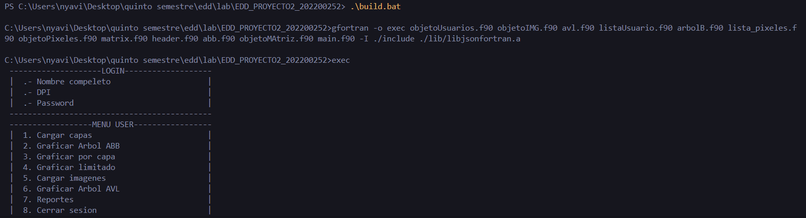

# Manual de usuario
## Menú
 
El menú cuenta con las siguientes funciones:
- **Cargar capas:** En esta sección se cargarán las capas de las imagenes y se guardarán en un arbol ABB.
- **Graficar Arbol ABB:** En esta sección se graficará el arbol ABB.
- **Graficar por capa:** En esta sección se podrán elegir las capas que se desean graficar.
- **Graficar limitado:** En esta sección se puede elegir la cantidad de capas a graficar preorder, inorder y postorder 
- **Cargar imagenes:** En esta sección se cargarán las imágenes que se generarán con las capas y se guardarán en un arbol AVL
- **Graficar Arbol AVL:** En esta sección se graficará el arbol AVL.
- **Reportes:** En esta sección se mostraran los siguientes datos:
    - Top 5 Imagenes con mas Capas
    - Todas las Capas que son Hojas 
    - Profundidad de Árbol de Capas 
    - Listar Capas(preorder, inorder y postorder)

## Estructura de archivo capas.JSON
```
[   {
      "id_capa": 0,
      "pixeles": [
        {
            "fila": 1,
            "columna": 1,
            "color": "#A51717"
        },
        {
            "fila": 1,
            "columna": 2,
            "color": "#A51717"
        }
      ]
    },
    {
      "id_capa": 1,
      "pixeles": [
        {
            "fila": 2,
            "columna": 1,
            "color": "#1737A5"
        }
        ]
    },
    {
      "id_capa": 2,
      "pixeles": [
        {
            "fila": 3,
            "columna": 2,
            "color": "#00FD17"
        },
        {
          "fila": 3,
          "columna": 3,
          "color": "#00FD17"
      }
        ]
    }
]
```

## Estructura de archivo imagenes.JSON
```
[
    {
        "id" : 3,
        "capas" : [4,2,1]
    },
    {
        "id" : 1,
        "capas" : [1]
    },
    {
        "id" : 2,
        "capas" : [2]
    }


]
```

## Estructura de archivo usuarios.JSON
```
[
    {
        "dpi":"1234567890123",
        "nombre_cliente": "AUX EDD",
        "password":"edd1s2022"
    },
    {
        "dpi":"6745567890123",
        "nombre_cliente":"cliente 2",
        "password": "edd1s2022"
    },
    {
        "dpi":"6745567890101",
        "nombre_cliente":"cliente3",
        "password": "edd1s2023"
    }
]
```

## Arbol ABB
Se define un módulo llamado abb_m.

Se utiliza el módulo objetoMatriz, que probablemente contiene la definición de un tipo llamado capaMatriz. Este tipo se usa más adelante en el código.

Se declara implicit none, lo que significa que todas las variables deben ser explícitamente declaradas. Esto ayuda a prevenir errores de escritura de variables.

Se define un tipo llamado Node_t, que representa un nodo en el árbol. Contiene un valor de tipo capaMatriz y dos punteros, uno al nodo hijo derecho y otro al nodo hijo izquierdo.

Se define un tipo llamado abb, que representa el árbol en sí. Contiene un puntero al nodo raíz del árbol.

Se declara un procedimiento insert dentro del tipo abb, que se utilizará para insertar valores en el árbol.

Se define la subrutina insert, que toma un valor val de tipo capaMatriz y lo inserta en el árbol. Si la raíz del árbol no está asociada (es decir, el árbol está vacío), se crea un nuevo nodo para la raíz y se le asigna el valor. De lo contrario, se llama a la subrutina insertRec para insertar el valor en el árbol de manera recursiva.

Se define la subrutina recursiva insertRec, que toma un nodo root y un valor val de tipo capaMatriz. Esta subrutina compara el valor val con el valor del nodo root y decide si debe insertarse en el subárbol izquierdo o derecho de manera recursiva hasta encontrar una posición adecuada.
```
module abb_m
    use objetoMatriz
    implicit none 
    private
 
    type :: Node_t
        type(capaMatriz) :: value
        type(Node_t), pointer :: right => null()
        type(Node_t), pointer :: left => null()
    end type Node_t

    type, public :: abb
        type(Node_t), pointer :: root => null()

    contains
        procedure :: insert

    end type abb

    contains    
    
    subroutine insert(self, val)
        class(abb), intent(inout) :: self
        type(capaMatriz), intent(in) :: val

        if (.not. associated(self%root)) then
            allocate(self%root)
            self%root%value = val
        else
            call insertRec(self%root, val)
        end if
    end subroutine insert
    recursive subroutine insertRec(root, val)
        type(Node_t), pointer :: root
        type(capaMatriz), intent(in) :: val
        
        if (val%IdC < root%value%IdC) then
            if (.not. associated(root%left)) then
                allocate(root%left)
                root%left%value = val
            else
                call insertRec(root%left, val)
            end if
        else if (val%IdC > root%value%IdC) then
            if (.not. associated(root%right)) then
                allocate(root%right)
                root%right%value = val
            else
                call insertRec(root%right, val)
            end if
        end if
    end subroutine insertRec
```

## Arbol AVL
Definición del módulo: El módulo se llama ModuloAVL y utiliza el módulo objetoImagen, que probablemente contiene la definición del tipo objimagen.

Declaraciones implícitas: Se declara implicit none, lo que significa que todas las variables deben ser explícitamente declaradas. Esto evita errores debido a errores tipográficos.

Definición de constantes: Se definen constantes para representar el estado de balance de los nodos del árbol. LEFT_HEAVY, BALANCED y RIGHT_HEAVY representan si un nodo es más pesado a la izquierda, está balanceado o es más pesado a la derecha, respectivamente.

Definición de tipos de datos: Se define un tipo de datos Node_t, que representa un nodo en el árbol. Contiene un valor de tipo objimagen, que probablemente es un tipo de imagen, un factor de balance y punteros a los hijos izquierdo y derecho.

Definición del tipo de árbol: Se define un tipo de datos Tree_t, que representa el árbol AVL. Contiene un puntero a la raíz del árbol y métodos para crear un nuevo árbol y para insertar un valor en el árbol.

Métodos del árbol: Se definen métodos para crear un nuevo árbol (newTree) y para insertar un valor en el árbol (insert).

Funciones de rotación: Se definen funciones para realizar rotaciones en el árbol cuando se desequilibra durante la inserción. Estas rotaciones son necesarias para mantener el balance del árbol AVL.

Función de inserción recursiva: Se define una función llamada insert2 que inserta un nuevo valor en el árbol de manera recursiva. Esta función se encarga de mantener el balance del árbol mediante rotaciones cuando sea necesario.
```
module ModuloAVL
    use objetoImagen
    implicit none

    ! Cons
    integer, parameter :: LEFT_HEAVY = -1
    integer, parameter :: BALANCED = 0
    integer, parameter :: RIGHT_HEAVY = +1

    type Node_t
        
        type(objimagen) :: Value
        integer :: Factor
        type(Node_t), pointer :: Left => null()
        type(Node_t), pointer :: Right => null()

    end type Node_t

    type Tree_t
        type(Node_t), pointer :: root => null()
        contains
        procedure :: newTree
        procedure :: insert

    end type Tree_t

    contains

    function NewNode(value) result(nodePtr)
        type(Node_t), pointer :: nodePtr
        type(objimagen), intent(in) :: value
        allocate(nodePtr)
        nodePtr%Value = value
        nodePtr%Factor = 0
        nodePtr%Left => null()
        nodePtr%Right => null()
    end function NewNode

    subroutine newTree(self)
        class(Tree_t), intent(inout) :: self
        self%root => null()
    end subroutine newTree

    function rotationII(n, n1) result(result_node)
        type(Node_t), pointer :: n, n1, result_node
        
        n%Left => n1%Right
        n1%Right => n
        if (n1%Factor == -1) then
            n%Factor = 0
            n1%Factor = 0
        else
            n%Factor = -1
            n1%Factor = 1
        end if
        result_node => n1
    end function rotationII

    function rotationDD(n, n1) result(result_node)
        type(Node_t), pointer :: n, n1, result_node

        n%Right => n1%Left
        n1%Left => n
        if (n1%Factor == 1) then
            n%Factor = 0
            n1%Factor = 0
        else
            n%Factor = 1
            n1%Factor = -1
        end if
        result_node => n1
    end function rotationDD

    function rotationDI(n, n1) result(result_node)
        type(Node_t), pointer :: n, n1, result_node, n2
    
        n2 => n1%Left
        n%Right => n2%Left
        n2%Left => n
        n1%Left => n2%Right
        n2%Right => n1
        if (n2%Factor == 1) then
            n%Factor = -1
        else
            n%Factor = 0
        end if
        if (n2%Factor == -1) then
            n1%Factor = 1
        else
            n1%Factor = 0
        end if
        n2%Factor = 0
        result_node => n2
    end function rotationDI

    function rotationID(n, n1) result(result_node)
        type(Node_t), pointer :: n, n1, result_node, n2
        n2 => n1%Right
        n%Left => n2%Right
        n2%Right => n
        n1%Right => n2%Left
        n2%Left => n1
        if (n2%Factor == 1) then
            n1%Factor = -1
        else
            n1%Factor = 0
        end if
        if (n2%Factor == -1) then
            n%Factor = 1
        else
            n%Factor = 0
        end if
        n2%Factor = 0
        result_node => n2
    end function rotationID

    recursive function insert2(root, value, increase) result(result_node)
        type(Node_t), pointer :: root, result_node, n1
        logical, intent(out) :: increase
        type(objimagen), intent(in) :: value

        if (.not. associated(root)) then
            allocate(result_node)
            root => NewNode(value)
            increase = .true.
        else if (value%id_imagen < root%Value%id_imagen) then
            root%Left => insert2(root%Left, value, increase)
            if (increase) then
                select case (root%Factor)
                    case (RIGHT_HEAVY)
                        root%Factor = 0
                        increase = .false.
                    case (BALANCED)
                        root%Factor = -1
                    case (LEFT_HEAVY)
                        n1 => root%Left
                        if (n1%Factor == -1) then
                            root => rotationII(root, n1)
                        else
                            root => rotationID(root, n1)
                        end if
                        increase = .false.
                end select
            end if
        else if (value%id_imagen > root%Value%id_imagen) then
            root%Right => insert2(root%Right, value, increase)
            if (increase) then
                select case (root%Factor)
                case (RIGHT_HEAVY)
                    n1 => root%Right
                    if (n1%Factor == 1) then
                        root => rotationDD(root, n1)
                    else
                        root => rotationDI(root, n1)
                    end if
                    increase = .false.
                case (BALANCED)
                    root%Factor = 1
                case (LEFT_HEAVY)
                    root%Factor = 0
                    increase = .false.
                end select
            end if
        end if

        result_node => root
    end function insert2

    subroutine insert(tree, value)
        class(Tree_t), intent(inout) :: tree
        type(objimagen), intent(in) :: value
        logical :: increase
    
        increase = .false.
        tree%root => insert2(tree%root, value, increase)
    end subroutine insert
```

## Arbol B
Definición del módulo: El módulo se llama BTree.

Declaración implícita: Se declara implicit none, lo que significa que todas las variables deben ser explícitamente declaradas.

Parámetros de orden del árbol: Se definen los parámetros MAXI y MINI, que representan el máximo y mínimo número de claves que puede tener un nodo en el árbol B. En este caso, es un árbol de orden 5, lo que significa que cada nodo puede contener hasta 5 claves y como mínimo 2.

Definición de tipos de datos: Se define un tipo de dato nodeptr, que es un puntero a un nodo en el árbol.

Se define el tipo de dato BTreeNode, que representa un nodo en el árbol B. Contiene un array val para almacenar las claves, un array link para los punteros a los hijos, y otros campos como btNAME y btPASS que probablemente almacenan información relacionada con nombres y contraseñas.

Subrutina insertB: Esta subrutina se utiliza para insertar una nueva clave en el árbol B. Toma el valor de la clave, el nombre y la contraseña como entrada, y el puntero a la raíz del árbol.

Función setValue: Esta función se utiliza para establecer el valor de una nueva clave en el árbol B. Es una función recursiva que busca la posición adecuada para insertar la nueva clave. Si el nodo está lleno, se llama a splitNode para dividir el nodo en dos y mantener el árbol balanceado.
```
module BTree
    implicit none

      ! Order 5
    integer, parameter :: MAXI = 4, MINI = 2

    type nodeptr
        type (BTreeNode), pointer :: ptr => null()
    end type nodeptr

    type BTreeNode
        integer(kind=8) :: val(0:MAXI+1)
        character(len=100) :: btNAME
        character(len=100) :: btPASS
        integer :: num = 0
        type(nodeptr) :: link(0:MAXI+1)
    end type BTreeNode
    
contains

subroutine insertB(val, btNAME, btPASS, root)
    integer(kind=8), intent(in) :: val
    character(len=*), intent(in) :: btNAME
    character(len=*), intent(in) :: btPASS
    integer(kind=8) :: i
    type(BTreeNode), pointer :: root
    type(BTreeNode), pointer :: child
    allocate(child)
    if (setValue(val, btNAME, btPASS, i, root, child)) then
            root => createNode(i, btNAME, btPASS, root, child)
    end if
end subroutine insertB

recursive function setValue(val, btNAME, btPASS, pval, node, child) result(res)
    integer(kind=8), intent(in) :: val
    integer(kind=8), intent(inout) :: pval
    character(len=*), intent(in) :: btNAME
    character(len=*), intent(in) :: btPASS
    type(BTreeNode), pointer, intent(inout) :: node
    type(BTreeNode), pointer, intent(inout) :: child
    type(BTreeNode), pointer :: newnode        
    integer :: pos
    logical :: res
    allocate(newnode)
    if (.not. associated(node)) then            
            pval = val
            child => null()
            res = .true.
            return
    end if
    if (val < node%val(1)) then
            pos = 0
    else
            pos = node%num
            do while (val < node%val(pos) .and. pos > 1) 
            pos = pos - 1
            end do
            if (val == node%val(pos)) then
                print *, "Duplicates are not permitted"
                res = .false.
                return
            end if
    end if
    if (setValue(val, btNAME, btPASS, pval, node%link(pos)%ptr, child)) then
            if (node%num < MAXI) then
                call insertNode(pval, btNAME, btPASS, pos, node, child)
            else
                call splitNode(pval, btNAME, btPASS, pval, pos, node, child, newnode)
                child => newnode
                res = .true.
            return
        end if
    end if
    res = .false.
end function setValue
```